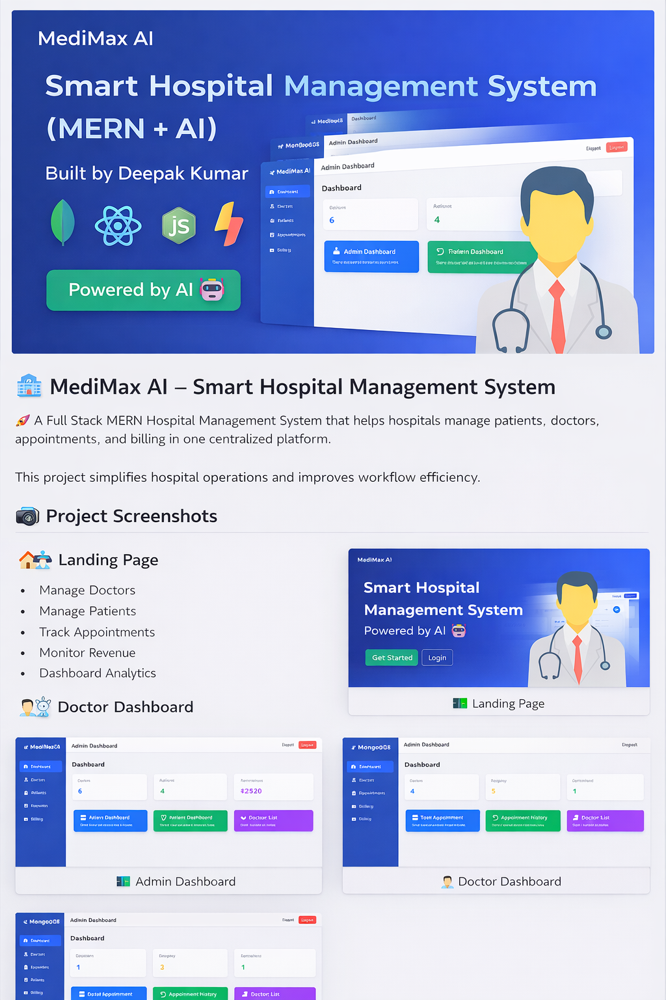
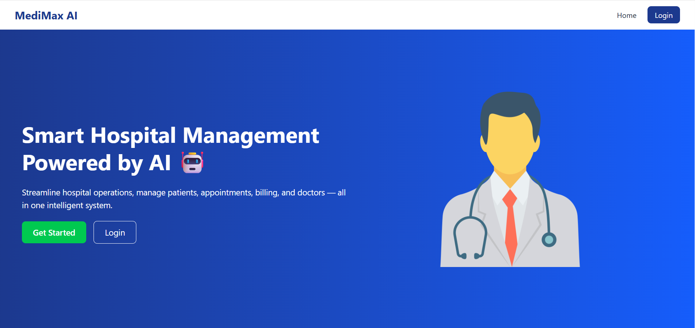
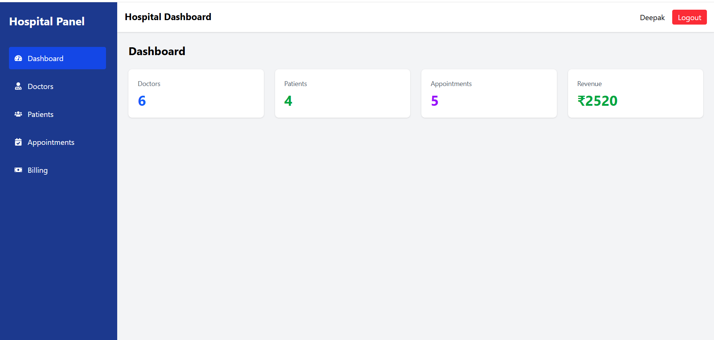
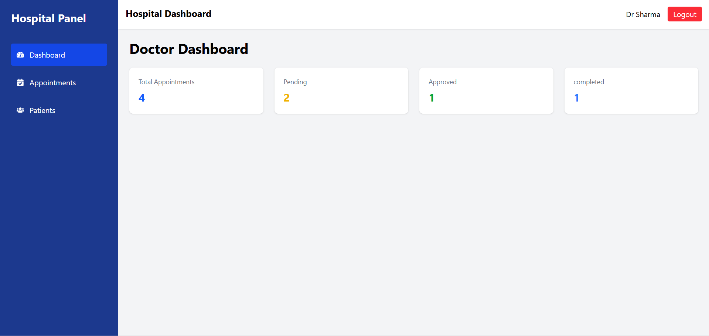

  

<h1 align="center">🏥 MediMax AI</h1>

Smart Hospital Management System (MERN Stack)

  
  
  
  
  

## 🚀 About The Project

MediMax AI is a **Smart Hospital Management System** built using the **MERN Stack**.  
It helps hospitals manage **patients, doctors, appointments, and billing** in a single platform.

The system improves hospital workflow and provides an easy interface for admins, doctors, and patients.

## ✨ Features

### 👨‍💼 Admin
- Manage doctors
- Manage patients
- View hospital statistics
- Track revenue

### 👨‍⚕️ Doctor
- View appointments
- Manage patient details
- Track completed appointments

### 🧑 Patient
- Book appointments
- View appointment history
- Explore doctors

  ## 🛠 Tech Stack

Frontend  
- React.js  
- Redux Toolkit  
- Tailwind CSS

Backend  
- Node.js  
- Express.js

Database  
- MongoDB

  ## 📸 Screenshots

### Landing Page

### Admin Dashboard

### Patient Dashboard

### Doctor Dashboard

